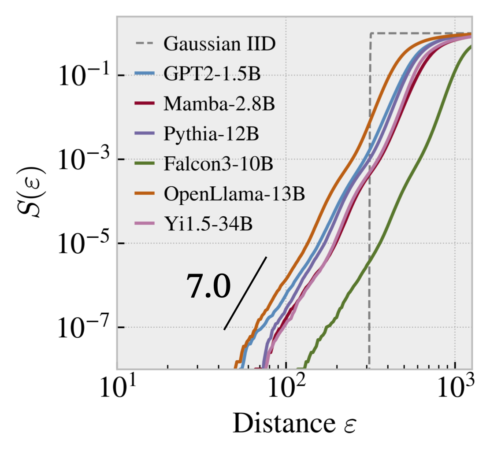

# Correlation Dimension of Autoregressive LLMs

> **A fractal-geometric approach to quantifying the epistemological complexity of text as perceived by language models.**

This repository contains the implementation for computing correlation dimension, a measure that bridges local and global properties of text generation in autoregressive language models. Unlike perplexity, correlation dimension captures long-range structural complexity and self-similarity patterns, revealing insights into model behavior, hallucination tendencies, and various forms of text degeneration.

## Quick Links

### 📚 Publications

- **NeurIPS 2025**
  - 📄 [Full Paper (arXiv)](https://arxiv.org/abs/2510.21258)
  - 🎯 [Conference Page](https://neurips.cc/virtual/2025/loc/san-diego/poster/116508)
- **Physical Review Research (2024)**
  - 📄 [arXiv](https://arxiv.org/abs/2405.06321) | [APS Journal](https://journals.aps.org/prresearch/abstract/10.1103/PhysRevResearch.6.L022028)

### 🔗 Resources

- 🏠 [Our Research Group @ Waseda University](https://ml-waseda.jp)
- 📊 [Conference Poster](asset/poster.pdf)

## Features

- Efficient computation using next-token log-probability vectors
- Robust to model quantization (down to 4-bit precision or more)
- Applicable across autoregressive architectures (Transformer, Mamba, etc.)
- Real-time inference integration

## Example: Correlation Integral Curves

The following figure shows correlation integral curves for various pre-trained language models on the "Newton's Philosophy" article from the Stanford Encyclopedia of Philosophy, compared to i.i.d. Gaussian noise:

*Models shown: GPT2-1.5B, Mamba-2.8B, Pythia-12B, Falcon3-10B, OpenLlama-13B, Yi1.5-34B*

---

**Code release coming soon.** 🚀
